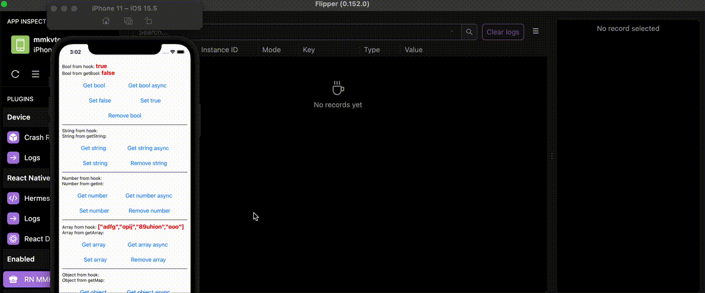

# Desktop Flipper plugin for [React Native MMKV Storage](https://github.com/ammarahm-ed/react-native-mmkv-storage)

## Features
- Show logs every time you interact with storage
- Edit value

_* Tested on Flipper v0.152.0, React Native v0.68.2, RN MMKV Storage source code from github_

## Install

Open Flipper and search on Plugin Manager

## FAQ

### My Android app crashes nonstop

This is known [issus](https://github.com/facebook/flipper/issues/3026#issuecomment-966631294) on Flipper. The workaround is keep Flipper opening while running app on debug mode.